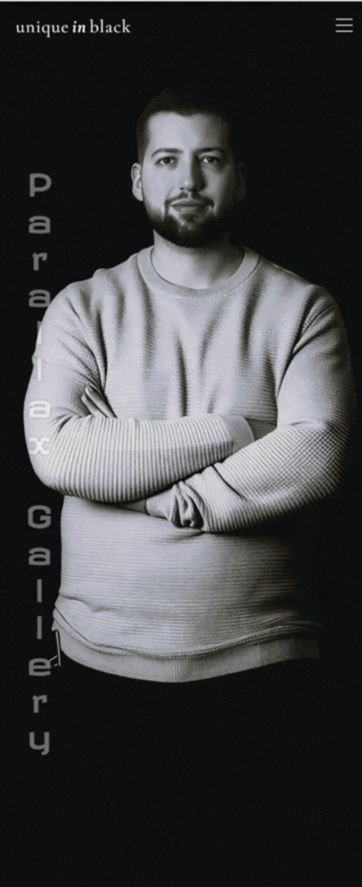

# Parallax Image Gallery

A single-page photo gallery that showcases parallax effects and scroll-driven animations using pure CSS. Images move at different speeds as you scroll, creating a sense of depth and motion. All without any JavaScript.

This project demonstrates how modern CSS can be used to achieve interactive, scroll-linked parallax animations entirely with CSS.

## Demo

  
▶️ Click to view demo

   

## Requirements

- Nodejs >= 20
- npm

## Development

1. `npm install`
2. `npm run dev`
